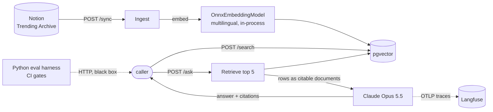

<div align="center">

# 📡 Radar RAG

[](https://github.com/zexion7873/radar-rag/actions/workflows/ci.yml)


**Ask the GitHub Radar archive a question, in Chinese or English, and get an answer grounded
in the weekly trending rows, with citations back to the rows it used.**

[](LICENSE)
[](#-prerequisites)
[](#-results)

No embedding API. No vector database service. No PyTorch. One JVM, one pgvector table, and a Python
harness that gates every pull request.

</div>

---

## 🧭 How it fits together



---

## 🌐 What it gives you

A standalone Java / Spring Boot service that adds LLM-powered intelligence on top of the
[GitHub Radar](https://whyisthistrending.vercel.app) Notion archive written by the `ai-assistant` routines. **P0** stands up the
skeleton: pgvector, Notion ingestion of the **Trending** table, and a semantic `/search`
endpoint. **P1** adds metadata-filtered search. **P2** adds a RAG `/ask` endpoint —
grounded Q&A with citations. **P3** adds a Python eval harness with CI gates, and **P4** traces every
request into Langfuse (see [docs/stack-plan.md](docs/stack-plan.md)).

> Not a proxy in front of Notion — it exposes *new* capabilities (semantic search and
> grounded Q&A) that the pure-reader [`github-radar-ui`](https://github.com/zexion7873/github-radar-ui) cannot do.

- `POST /sync` — pull the Trending Archive from Notion and replace its rows in pgvector: one
  document per Notion row (one repo, one week), keyed by the Notion page id.
- `POST /search` — semantic search over the embedded rows, optionally filtered by metadata
  (`source` / `category` / `language` / `week` exact match, `stars_per_week` ≥ `minStars`).
- `POST /ask` — ask a question in natural language; the service retrieves the relevant radar
  rows from pgvector, sends them to **Claude** as citable documents, and returns the answer plus
  the rows it actually cites as **citations**. Needs `ANTHROPIC_API_KEY`; `/sync` and `/search` do not. Runs on
  `claude-opus-5-5`. A model refusal returns 502; an Anthropic failure returns 502 (client error,
  e.g. a bad key) or 503 (rate limit or overload, after one retry), without the upstream body.

---

## 📋 Prerequisites

- Java 25 or newer (CI builds on Temurin 25)
- Docker (for the pgvector Postgres)
- The **Notion integration token** already shared into the archive tables

Embeddings run **locally in-process** (ONNX `paraphrase-multilingual-MiniLM-L12-v2`, 384-dim) — no
API key. `scripts/fetch-models.sh` downloads the model (~480 MB) once, at a pinned Hugging Face
revision with a sha256 check; the service loads it from `models/` and will not start without it.

---

## 🏃 Run

```bash
# 0. Fetch the embedding model (once; re-runs skip files that already match)
scripts/fetch-models.sh

# 1. Start pgvector Postgres (creates the vector/hstore/uuid-ossp extensions via init.sql)
docker compose up -d

# 2. Provide the Notion token (P0 needs just this one)
export NOTION_TOKEN=ntn_...

# 3. Run the service (creates the vector_store table on first boot)
mvn spring-boot:run

# 4. Ingest the Trending table, then search it
curl -X POST localhost:8080/sync
curl -X POST localhost:8080/search \
  -H 'Content-Type: application/json' \
  -d '{"q":"agent frameworks and tool-use orchestration","topK":5}'

# P1: narrow the same search by metadata (all filter fields optional, AND-combined)
curl -X POST localhost:8080/search \
  -H 'Content-Type: application/json' \
  -d '{"q":"agent frameworks","topK":5,"language":"Python","minStars":500}'

# P2: grounded Q&A with citations (needs an Anthropic key)
export ANTHROPIC_API_KEY=sk-ant-...
curl -X POST localhost:8080/ask \
  -H 'Content-Type: application/json' \
  -d '{"q":"which trending repos are about agent skills, and what do they do?"}'
```

`/search` returns each hit's document `id`, `text`, `metadata` (source/repo/week/category/language/url),
and a similarity `score`. `/ask` returns `{answer, citations, sources, usage}`. `sources` are the 5
retrieved rows (`id` / `repo` / `url` / `week` / retrieval `score`); `citations` are the sources the
answer cites, each with the passages it quoted (`citedText`); `usage` is the call's `model`,
`inputTokens` and `outputTokens` (thinking included).

The OpenAPI spec is at `/v3/api-docs` and Swagger UI at `/swagger-ui.html`, both generated from the
controllers. The prod profile turns both off.

### 🔒 Prod profile

`SPRING_PROFILES_ACTIVE=prod` is the public deployment's configuration; the image and CI run without it,
so the eval gates measure the service unthrottled and at medium effort. It adds:

- **`/sync` needs `Authorization: Bearer $SYNC_SECRET`.** Boot fails without `SYNC_SECRET`; set but
  empty, every call gets `401`.
- **Per-client rate limits.** `/ask`: 5 a minute and 20 a day; `/search`: 30 a minute; past either,
  `429` with `Retry-After`. The client is the right-most `X-Forwarded-For` entry (the address Cloud
  Run's front end appends), an IPv6 client its /64.
- **`/ask` at low effort**, generic error bodies (no `message`), `INFO` logs, no Swagger UI or
  `/v3/api-docs`, and no fallback for `POSTGRES_PASSWORD`.

### ☁️ Deploy

A push to `main` that touches the service runs the Deploy workflow: it builds the image, pushes it to
Artifact Registry and deploys it to Cloud Run in asia-east1 (2 GiB, at most one instance, the prod
profile), then smoke-tests `/search`, `/sync` without the secret and Swagger. It signs in through
Workload Identity Federation, so no Google Cloud key is stored anywhere; every secret, the Neon JDBC
URL included, is read from Secret Manager at startup. The Weekly sync workflow posts `/sync` on Mondays
at 03:00 UTC, two hours after the Trending routine writes the week's rows.

### 🐳 In a container

The image fetches the model itself and carries everything the service loads, so it downloads nothing
at runtime. CI's retrieval gate runs this image. Compose builds and runs it beside Postgres, reading
`.env` (quoted values included):

```bash
docker compose --profile app up --build
```

Without `--profile app`, `docker compose up -d` starts Postgres alone, for `mvn spring-boot:run`.
The container gets 2 GiB and no swap, as on Cloud Run: ONNX Runtime holds the model natively
(~1.1 GB) and the JVM about 0.3 GB, so a boot needing more fails locally first. The image starts from
an AOT cache made by a training run at build time, inside the image, because the cache only loads on
the JVM that trained it.

---

## 🧪 Test

```bash
mvn -B verify   # unit + slice tests, then AskFlowIT; no tokens. CI runs the same on every PR.
```

`AskFlowIT` starts a pgvector container through Testcontainers, so `verify` needs a running Docker.
On macOS, Docker Desktop must expose its default socket, or set
`DOCKER_HOST=unix://$HOME/.docker/run/docker.sock`.

---

## 📏 Evals (`evals/`, Python)

A typed Python package (uv, pydantic, httpx, pytest, mypy strict, ruff) that tests the service as a
black box over HTTP. It serves a frozen copy of the Notion Trending table from a local stub, so an
eval needs no Notion token and does not move when the table does. `/sync` replaces every trending
row, so rows from an earlier live sync do not leak into an eval.

```bash
cd evals
uv sync
uv run ruff check && uv run ruff format --check && uv run mypy && uv run pytest   # unit tests

# Against a running service: start it with NOTION_TOKEN=dummy NOTION_BASE_URL=http://127.0.0.1:8765,
# then the tests start the stub on 8765, POST /sync from the fixture, and query /search.
EVAL_SERVICE_URL=http://localhost:8080 uv run pytest -m service

# Retrieval eval over the golden set (golden_v1.jsonl, 62 items). The first run writes the
# baseline with --write-baseline; later runs drop it and fail on any hit@5 hit→miss flip.
uv run radar-evals --golden golden_v1.jsonl --fixture fixtures/trending.json \
  --model-id paraphrase-multilingual-MiniLM-L12-v2 --out results/latest.json --baseline results/baseline.json --write-baseline

# LLM eval (paid, ~$3 per full run): /ask on every golden item, code checks (no empty answer, no
# repo named or cited outside the retrieved rows), citation precision
# against the golden labels, then DeepEval metrics judged by claude-sonnet-5-5. The service and
# this command both need ANTHROPIC_API_KEY.
uv run radar-evals-llm --golden golden_v1.jsonl --fixture fixtures/trending.json --out results/llm-latest.json

# Re-capture the fixture (reads Notion; keeps only the columns the service parses).
NOTION_TOKEN=ntn_... uv run freeze-notion
```

CI runs the unit tests in `evals` and the live-service tests in `eval-retrieval`, against a
pgvector service container on the same tag as `docker-compose.yml`. The LLM eval runs in
`eval-llm.yml` only when the repo owner adds the `eval:llm` label to a PR or dispatches it; it reads
the key from the `ANTHROPIC_API_KEY` repository secret, and with the `LANGFUSE_PUBLIC_KEY` /
`LANGFUSE_SECRET_KEY` secrets each run is also a Langfuse experiment. It fails on any `/ask` error, empty answer,
repo named or cited outside the retrieved rows, and when a metric's mean is below 0.7.

---

## 🔭 Tracing (Langfuse)

With `LANGFUSE_PUBLIC_KEY` and `LANGFUSE_SECRET_KEY` set (and `LANGFUSE_BASE_URL` for a region other
than Japan), the service sends every request's spans to Langfuse over OTLP: the HTTP request, the
vector search, the chat client and the Claude call, which Langfuse shows as a generation with its
prompt, answer, token usage and cost. Without both keys nothing leaves the process.

When the same keys are set for `radar-evals-llm`, the run mirrors the golden set to the Langfuse
dataset `golden_v1`, runs it as an experiment, passes `traceparent` to `/ask` so the service's spans
nest under each item, and attaches the judge's scores and citation precision to each item. Such a
run needs the full golden set: a subset run against the fuller dataset is refused.

---

## 🗂️ Layout

```
src/main/java/com/radar/intel/
├── RadarIntelligenceApplication.java   # boot + @ConfigurationPropertiesScan
├── notion/
│   ├── NotionProperties.java           # radar.notion.* config
│   ├── NotionClient.java               # resolve data source + paginated query (mirrors lib/notion.ts)
│   ├── NotionProps.java                # typed property extractors
│   └── TrendingRow.java
├── ingest/
│   ├── TrendingIngestService.java      # Notion rows -> Documents; /sync replaces the trending rows
│   └── IngestController.java           # POST /sync, behind a bearer secret when one is set
├── embedding/
│   ├── EmbeddingProperties.java        # radar.embedding.* config (model and tokenizer paths)
│   ├── EmbeddingConfig.java            # the EmbeddingModel bean
│   └── OnnxEmbeddingModel.java         # ONNX Runtime + DJL tokenizer, mean pooling in Java
├── search/
│   └── SearchController.java           # POST /search
├── ask/
│   └── AskController.java              # POST /ask — retrieve, Claude with citation documents, cited rows
├── ratelimit/
│   └── RateLimitFilter.java            # prod only: per-client token buckets on /ask and /search
├── tracing/
│   ├── LangfuseProperties.java         # radar.langfuse.* config
│   ├── LangfuseTracingConfig.java      # OTLP span exporter to Langfuse; a no-op without keys
│   └── ChatContentObservationFilter.java  # prompt and answer onto the chat model span
└── ApiErrorHandler.java                # upstream failures -> 502/503 with a generic body; causes logged
```

---

## 📊 Results

All numbers come from the CI runner over the 62-item golden set: hit@5, recall@5 and MRR at the
(url, week) level, on the 42 answerable items unless the column says otherwise.

**Bug 1, one row per repo per week** (MiniLM, ids keyed by Notion page id instead of repo url):
a fixture sync stores 190 rows instead of 111, and recall@5 rises from 0.126 to 0.166.

**Embedding A/B** (decided by a rule fixed before any run: a multilingual model ships only if it
turns at least 2 more zh-TW items into hits than the control, and mE5 only if it beats paraphrase
by at least 2):

| Model | hit@5 | R@5 | MRR | zh-TW hit@5 | pure-CJK hit@5 | English hit@5 |
|---|---:|---:|---:|---:|---:|---:|
| all-MiniLM-L6-v2 (before) | 0.476 | 0.166 | 0.352 | 0.238 (5/21) | 0.273 | 0.714 |
| **paraphrase-multilingual-MiniLM-L12-v2** (shipped) | **0.786** | **0.404** | 0.633 | **0.762 (16/21)** | **0.818** | **0.810** |
| multilingual-e5-small | 0.738 | 0.355 | **0.649** | 0.714 (15/21) | 0.636 | 0.762 |

MiniLM's English WordPiece vocabulary turns 76% of the corpus's CJK characters into `[UNK]`; both
multilingual models close the English-minus-Chinese hit@5 gap from 0.476 to 0.048. mE5 ranks the
first hit higher (MRR) but finds one fewer zh-TW item, so paraphrase ships.

**Answer quality** (`/ask` on `claude-opus-5-5` with native citations, judged by
`claude-sonnet-5-5` through DeepEval; two runs on one commit, all 62 items): no errors, empty
answers, or repos named or cited outside the retrieved rows.

| metric | items | run 1 | run 2 |
|---|---:|---:|---:|
| Faithfulness | 42 answerable | 1.000 | 0.998 |
| AnswerRelevancy | 42 answerable | 0.904 | 0.915 |
| Attribution (GEval) | 42 answerable | 0.943 | 0.945 |
| Abstention (GEval) | 10 no-answer + 10 adversarial | 0.870 | 0.860 |
| Citation precision | items with labels and citations | 0.640 | 0.637 |

The judge agrees with a blind human grade on 11 of 12 items, in each of two hand-graded sets. The
means move by at most 0.011 between runs and single items by up to 0.27, so changes are compared on
means. A run costs about $3.3.

---

## 🧠 Notes / decisions

- **Embeddings are local & keyless.** In-process ONNX (`paraphrase-multilingual-MiniLM-L12-v2`,
  384-dim, maxLength 128) through `OnnxEmbeddingModel`: ONNX Runtime plus the DJL tokenizer, with
  the mean pooling in Java, summed in PyTorch's order so the vectors stay bit-identical to Spring AI's
  transformers module (which needs PyTorch for that pooling alone). Chosen by the A/B under Results. After switching to another 384-d model, `POST /sync` re-embeds every row; a model with
  other dimensions also needs `spring.ai.vectorstore.pgvector.dimensions` changed and the
  `vector_store` table recreated (the embedding column is a fixed-width `vector(N)`).
- **Exact vector search.** `index-type: NONE`: at a few hundred rows an HNSW index buys no speed,
  and it applies metadata filters after its approximate scan, so a week-filtered `/search` could
  return fewer than `topK` rows. PgVectorStore never drops an existing index and creates the
  table only at startup, so a table created under the old HNSW setting needs, once: stop the
  service, `docker compose exec postgres psql -U radar -d radar -c 'DROP TABLE vector_store'`,
  start it again, then `POST /sync`.
- **Full-refresh re-sync.** `POST /sync` deletes the trending rows and adds the table's current
  rows in one transaction, so a row deleted in Notion does not linger and a failed embed leaves the
  old rows in place. Ids are Notion page ids: the table has one row per repo per week.
- **Spring AI moves fast.** Versions/artifact ids match the reference docs at scaffold time —
  verify against `start.spring.io` / the current reference when you build.
- **RAG is grounded, not filtered.** `/ask` retrieves from the same pgvector store `/search` uses
  (`VectorStoreDocumentRetriever`), sends each row as an Anthropic citation document titled
  "repo week", and returns only the rows Claude cites. It takes only a question — no
  metadata-filter fields — so it has no SQL-filter input surface (unlike `/search`, which validates its filter values). The retriever keeps every
  candidate (similarity threshold 0) and bounds the context by `topK`.

---

## ⚠️ Known limitations

- **Demo link pending.** The Deploy workflow ships `main` to Cloud Run; the public URL goes here once
  the first deploy is verified. Without the prod profile `/sync` is open and Swagger UI is on, which is
  fine on loopback, the default bind.
- **No bot check on `/ask` until the page.** Cloudflare Turnstile arrives with the "Ask the radar"
  page (M11); until then the per-client limit and the Anthropic workspace's monthly spend cap bound
  what `/ask` can spend.
- **One source.** Only the Trending Archive is ingested; Blog and Loot are P5.
- **Small, hand-labelled golden set.** 62 items. The retrieval gate catches any flipped hit, but the
  LLM metrics move by up to ~0.03 between identical runs, so only a drop beyond that reads as a
  regression.
- **Exact vector search.** Right for a few hundred rows; it scans every row, so a much larger archive
  needs an index and a filter strategy first.
- **amd64 image, 2 GiB.** The image targets Cloud Run's architecture, and ONNX Runtime keeps ~1.1 GB
  of the model in native memory.

---

## 🗺️ Next

~~P1 metadata-filtered search~~ (done) · ~~P2 RAG `/ask` with citations~~ (done) · ~~P3 eval
harness (retrieval metrics + LLM-as-judge) + CI gates~~ (done) · ~~P4 Langfuse tracing~~ (done) · P5 Blog/Loot ingest +
an "Ask the radar" page served by this service ([github-radar-ui](https://github.com/zexion7873/github-radar-ui) only links to it, so it stays a
pure Notion reader).

The target stack and the milestone order (M0–M11, each with a checkable done-when) are in
[docs/stack-plan.md](docs/stack-plan.md).

---

## ⚖️ License

[MIT](LICENSE).
